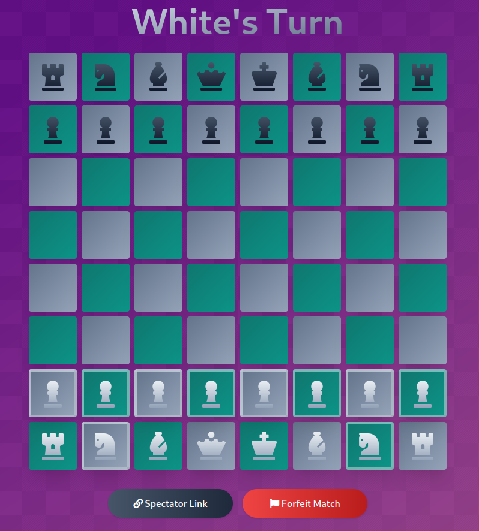

# [Chessmatch](https://chessmatch.cf)
### Play chess with others

---

### Deploy to a Server:
1. Setup a DNS record to point to your server's public IP address
2. Setup a firewall to only allow `SSH/HTTP/HTTPS` inbound connections
3. Install elixir 1.10+, erlang, and caddy
4. `git clone https://github.com/JMS55/chessmatch && cd chessmatch`
5. `Replace "chessmatch.cf" with your domain in /install/Caddyfile and /config/prod.exs`
6. `cd install && bash install.sh`
7. `reboot`
